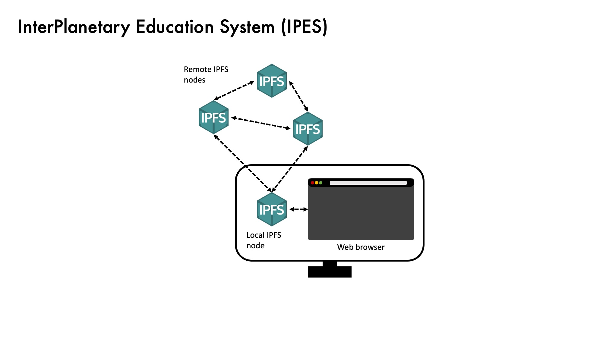

Mock up of a education portal that uses decentralised web technology

## Table of Contents <!-- omit in toc -->

- [Getting started](#Getting-started)
  - [Configuring local IPFS Daemon](#Configuring-local-IPFS-Daemon)
  - [Configuring IPFS Companion](#Configuring-IPFS-Companion)
- [Project Description](#Project-Description)
  - [Inspiration](#Inspiration)
  - [Whats it does](#Whats-it-does)
  - [How we built it](#How-we-built-it)
  - [Challenges we ran into](#Challenges-we-ran-into)
  - [Accomplishments that we're proud of](#Accomplishments-that-we're-proud-of)
  - [What we learned](#What-we-learned)
  - [What's next for InterPlanetary File System](#What's-next-for-InterPlanetary-File-System)
  

## Getting Started <!-- omit in toc -->

# Getting started
This github repository contains a proof of concept education platform that replaces the content download and upload with IPFS equivalent. An instance of this project is deployed on [Fleek](https://fleek.co/) and can be access via this url [https://steep-sound-9969.on.fleek.co/](https://steep-sound-9969.on.fleek.co/).

This project must be used in conjunction with the [IPFS Companion](https://chrome.google.com/webstore/detail/ipfs-companion/nibjojkomfdiaoajekhjakgkdhaomnch?hl=en)  chrome extension as well as as IPFS daemon running on your computer. The easiest way to get an IPFS daemon running on your computer is to install the [IPFS Desktop](https://docs.ipfs.io/install/ipfs-desktop/#windows) app. Alternatively one can also download either the [Go-IPFS](https://docs.ipfs.io/install/command-line/#system-requirements), or the [JS-IPFS](https://js.ipfs.io) project. These two projects will have to be used via the command line.

## Configuring local IPFS Daemon
Once a local IPFS daemon is successfully running on your computer, you will have to configure your node to accept incoming request from either your localhost website or the instance hosted on Fleek. If this step is not done, your local Daemon will reject incoming request due to CORS reasons. In your daemon configuration json, locate the "HTTPHeaders" key and input the following

```json
"HTTPHeaders": {
    "Access-Control-Allow-Credentials": [
        "true"
    ],
    "Access-Control-Allow-Methods": [
        "PUT",
        "POST"
    ],
    "Access-Control-Allow-Origin": [
        "webui://-",
        "http://localhost:3000",
        "http://127.0.0.1:5001",
        "https://webui.ipfs.io",
        "https://steep-sound-9969.on.fleek.co",
        "http://steep-sound-9969.on.fleek.co.ipns.localhost:8080"
    ]
}
```
After editing the configuration file, restart the IPFS daemon for changes to take effect.

## Configuring IPFS Companion
To get IPFS companion to route all IPFS traffic through the local node, the following changes should be done to the default IPFS companion app. At time of writing, the IPFS companion app is only available on:
1. Firefox
2. Firefox for Adroid 
3. Chrome
4. Brave
5. Opera
6. Edge

*Note: these settings are only necessary for following this project's routing philosophy. If you want to use it for other purposes, the default settings work.*

I will be using the one on chrome as an example but the user experience should not vary too much between the above browsers. After installing the extension, click in the extension and navigate to the setting page by pressing on the gear icon on the top right of the pop-up.


In the settings page, perform changes in the following locations. Turn off Automatic Mode to prevent the browser node from query from a public gateway.


# Project Description

## Inspiration

The internet serves a very important role in education today. This is especially so during the Covid-19 crisis, availability of the internet allows students to continue their education even during harsh lockdowns. Video, audio, and interactive tools could be used to substitute and even enhance the education experience.

Beyond enhancing the incumbent education system, the internet can also provide education to places where previously impractical. Having an internet connection would allow children in the rural parts of the world to gain access to the vast pool of resources that are currently available


"Two-thirds of the world's school-age children do not have internet connection in their homes<sup>1</sup>." The 4G network reaches 85% of the world's population. However, almost half of that population is still offline<sup>2</sup>. A basic 1.5GB data plan still costs more than 2% of monthly income for many people in the developing country. Education is arguably the most effective tool to increase prosperity in these regions, and the internet can provide access to vast educational resources. On the flip side, denying these communities internet access increases the division between higher and lower income levels.

The chief reason for a lack of internet access is simply lack of infrastructure for certain segments of the world. Telco companies are reluctant to invest in less populated areas since there will be lower returns on investment. Satellite internet has the potential to lift this population from the other side of the digital divide, but the technology is still in its nascent stages and may take years before widespread, affordable adoption. Till then we need a solution that we can apply in the much more immediate future.

Our team believes that IPFS could aide the provision of educational material in these regions during this transitional phase. Imagine if a family or a group of students can all share one internet connection but still get their education materials as if they all had their individual data link. This will allow for a high-speed internet connection with a low-speed connection cost.

## What it does

A crucial part of online education is the dissemination of teaching materials such as videos and text content. In the traditional situation, each student wishing to access said reading material each query from the server. This causes n-1 unnecessary downloads where n is the number of students requesting the same material.


With IPFS, educational content required by students only needs to be downloaded once. With the content cached in the first download, further download requests would be served by the cache and no further internet connection is needed. This download method has the potential to dramatically reduce the bandwidth required to serve a large population of students. Imagine a whole class of students from the same village being able to access educational content by sharing a single satellite or 4G connection. While making sure that each family can afford an internet connection might not be possible today, dividing the cost of the internet over a few families might.

The web app we developed is a mock-up of a typical Learning Management System (LMS) use today such as [Moodle](https://moodle.org/), or [Blackboard Learn](https://www.blackboard.com/en-mea/teaching-learning/learning-management/blackboard-learn). The IPFS implementation should be transparent to the students actually using the portal so there is no need change in the way a student might go onto the internet to receive learning materials.

On the download page, students have the ability to download documents as per a normal website. The only difference is that the documents are being retrieved through the local IPFS gateway instead of directly through the internet

On the submission page, when a student uploads an assignment or project, the website directs the file to be pinned on the local IPFS instance and returns the CID of the file back to the student.

## How we built it

Excited by the prospect of using IPFS to produce affordable online education, we look at the tools available today within the IPFS ecosystem and produced a proof of concept of how an Inter-Planetary Education System (IPES) can look like.

Our IPES proof of concept consists of two main components. First, a local node sitting in each student’s computer handles all the caching and sharing of IPFS files. Second, a web app hosted on the IPFS network serves as the initial source of information.

For IPES to work we need nodes on the network to be seeding the data so that other nodes can download it in a distributed way. For that, we will have a local IPFS daemon running as a background process on the computer for each student. This IPFS node serves as a persistent caching point as well as a gateway to control the flow of data, ensuring that the minimum internet bandwidth is used to get the requested file. For our prototype, IPFS desktop is being used to create the persistent local node.

The web app component of the IPES is a web app that serves IPFS files instead of normally hosted files. When a request for downloading content is being received, the web app will point to the local IPFS node and ask the node for the file, this will allow the node to find the lowest data usage solution. **Currently, the browser plugin, IPFS companion, is used. It allowed us to direct IPFS requests through our local gateway.**

As a proof of concept, we have hosted the current implementation of the web app on [Fleek](https://fleek.co/). Our GitHub repository contains instructions on the configurations for both the IPFS companion and plugin as well as the IPFS desktop app to make the above-described flow work.

## Challenges we ran into

Most of the challenges that we have encountered during our build were of configuring the local node to behave as we designed.

Firstly, we encountered CORS issue when the Fleek hosted website tries to upload documents through the local node. While this is solved by editing the configuration files, the production version should ideally not require any configuration changes from the end user perspective.

Secondly, as the objective of this project is to limit the amount of data transfer to and from the internet, we were not able to configure a whitelist of peers in which our local node and transfer data to and fro. Ideally, nodes should be able to identify and only peer with other local nodes. Only one node should have the ability to peer with the rest of the network. This would give us more control over minimising bandwidth for our particular application.

## Accomplishments that we're proud of

We are proud to be able to pull together a proof of concept given that we entered this hackathon relatively late. 

## What we learned

Through this hackathon journey, the team was able to learn and experiment with the state of the art in decentralised internet. Importantly, we also learnt about potential areas of improvements that we could potentially contribute towards this shared vision of a more equal internet.

## What's next for InterPlanetary File System

In pushing our application to the next level, our team will be looking achieving a higher level of control in terms of who and how our local node does peering.


**References:**

1. https://www.unicef.org/press-releases/two-thirds-worlds-school-age-children-have-no-internet-access-home-new-unicef-itu

2. https://www.itu.int/en/ITU-D/Statistics/Pages/facts/default.aspx


